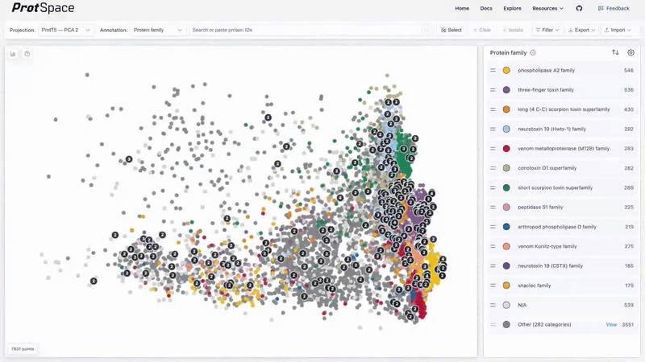

# Navigating the Scatterplot

The scatterplot is the main visualization area where proteins appear as points. Learn how to navigate, select, and explore your data.

## Quick Reference

| Action              | How                                      |
| ------------------- | ---------------------------------------- |
| Zoom in/out         | Mouse wheel or pinch gesture             |
| Pan                 | Click + drag on background               |
| Reset view          | Double-click on background               |
| Select one          | Click a point                            |
| Add to selection    | **⌘/Ctrl** + click another point         |
| Box select          | Click **Select**, then drag a rectangle  |
| Lasso select        | Switch to lasso tool, then draw freeform |
| Clear selection     | Press **Escape** or click **Clear**      |
| Exit selection mode | Press **Escape** (when no selection)     |
| Focus search        | **⌘/Ctrl + K**                           |

## Navigation

- **Zoom**: Scroll wheel or pinch gesture
- **Pan**: Click and drag on the background
- **Reset**: Double-click the scatterplot to fit all proteins

## Selection

### Single & Multi-Select

- **Click** a point to select it
- **⌘ + click** (Mac) or **Ctrl + click** (Windows) to add to selection
- Click the same point again to deselect it

### Box Selection

1. Click the **Select** button in the control bar
2. Drag to draw a rectangle
3. All proteins inside are selected

### Lasso Selection

1. Click **Select** to enter selection mode
2. Click the **lasso** icon in the tool picker that appears
3. Click and drag to draw a freeform outline around proteins
4. Release to select all enclosed proteins

The lasso requires at least 3 points to form a valid selection area. Switch back to the **rectangle** icon at any time.

::: tip Additive Mode
When the **Select** button is active, all selections (clicks, box drags, and lasso draws) are additive. Without it, each new selection replaces the previous one.
:::

### Clearing

- Press **Escape** to clear selections (first press), then exit selection mode (second press)
- Click the **Clear** button

## Understanding the Display

### Point Position

Points close together have similar embeddings - often indicating similar structure, function, or evolutionary history.

### Point Colors

- **Categorical** (reviewed, protein family, species): Unique color per category
- **Multi-label** (EC numbers, domains): Pie charts showing multiple values

### Protein Tooltip

Hover over a point to see a tooltip with details about that protein:

- **Protein ID** and **UniProtKB ID** (if available)
- **Protein name** and **Gene name** (if available)
- **Annotation values** for the currently selected annotation
- **Scores** (for InterPro domain annotations, e.g., E-values) or **evidence codes** (for GO terms, subcellular location, etc., e.g., EXP, IDA)

Protein name, gene name, and UniProtKB ID are tooltip-only and don't appear in the [Annotation dropdown](/explore/control-bar#_2-annotation-selector).

### Duplicate Points

When multiple proteins share the exact same coordinates, a **count badge** appears on the point (when enabled in the legend settings). Click a stacked point to expand it into a spider layout showing each individual protein.

### Projection Metadata

A small bar-chart icon sits in the **top-left corner** of the scatterplot. Hover it (or focus it with
the keyboard) to open a **Projection Metadata** panel describing how the currently selected
projection was computed. Switching projections updates the panel.

::: tip
The icon only appears when the loaded bundle carries metadata for that projection. Bundles built
without projection metadata show no icon at all.
:::

The panel lists the parameters the dimensionality-reduction method was run with, taken from the
bundle's projection metadata table. The exact rows depend on the method:

- **PCA**, `N Components`, plus `Explained Variance Ratio` (one value per component)
- **UMAP**, `N Neighbors`, `Min Dist`, `Metric`, `Random State`, and the rest of the UMAP
  parameter set
- **Source**, the name of the embedding the projection was computed from, useful when a bundle
  contains projections from several embeddings

The projection name and its dimension count are omitted from the panel, you already pick those in
the [Projection selector](/explore/control-bar).

Values are formatted for readability: whole numbers print as-is, other numbers are rounded to three
decimals (two for explained-variance values), booleans show as **Yes**/**No**, lists are
comma-separated, and a missing value shows as `N/A`.

#### Quality metrics

If the bundle carries faithfulness metrics, the panel also includes a **Quality** row, how well the
2D or 3D layout preserves the structure of the original high-dimensional embedding:

| Metric              | Meaning                                                                    |
| ------------------- | -------------------------------------------------------------------------- |
| `knn_overlap`       | Fraction of each point's k nearest neighbors preserved in the projection   |
| `trustworthiness`   | Penalizes points pulled together in the projection that were far apart     |
| `continuity`        | Penalizes points pushed apart in the projection that were close together   |
| `random_triplet`    | Fraction of random point triplets whose relative ordering survives         |
| `spearman_distance` | Rank correlation between high-dimensional and projected pairwise distances |

Each metric carries its value plus provenance, the neighborhood size `k`, the high-dimensional
distance metric, the source embedding, and whether the computation was sampled. Metrics that could
not be computed (for example on very large datasets) are recorded with a skip marker instead of a
value.

::: warning
Run `protspace stats` standalone and then `protspace bundle` **without** `-s`. A bundle written with
statistics has five parts, and the web app currently rejects five-part bundles, so a `--stats` bundle
will not open at all. The faithfulness metrics travel in the projection metadata
(`info_json.quality`), so they still reach this panel from a bundle built without the statistics
part. See [Data Format](/guide/data-format) for the full explanation.

Quality metrics are also rendered as a single raw JSON row rather than one row per metric, so this
section is readable but not pretty.
:::
